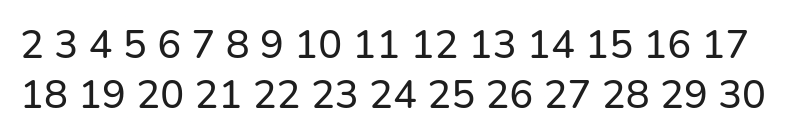
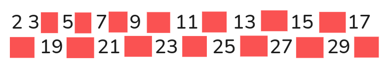
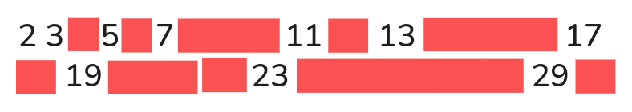

## Algoritmo Crivo Eratóstenes
Defina um valor limite e crie, apartir do número 2, uma lista até o valor limite.

Agora, pegue o primeiro número da lista (neste caso, 2) e remova todos os seus múltiplos da lista: exceto o número 2.

Após remover os múltiplos do primeiro número da lista, pule para o segundo e repita o mesmo procedimento.

## Referência

https://pt.wikipedia.org/wiki/Crivo_de_Erat%C3%B3stenes
